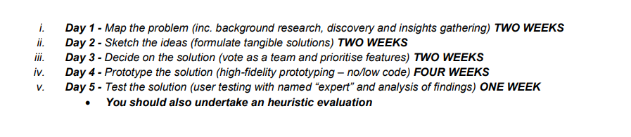

 Robin <br/>
 This is second line 
 ---

# Robin
## Robin

<p> This is my first Repo from VScode. I am writing  a paragraph. It needs to be at least 3 sentences.</p>   

__Bold__   

_Italic_  

~~Strikethrough~~  

### List
1. Text1
2. Text2  
    2.1 Text-1  
    2.2 Text-2
3. Text3

### Unordered List  

- Text1  
- Text2  
- Text3  

### Inline code  

` This is inline `


### Multi-line code

``` html
<html>
<head>
 </head>
 <body> </body>
 </html>

 ```  

 ### Task List

 - [x] Task1
 - [] Task2
 - [] Task3  

 ### Automatic link
 http://www.studywithanis.com  


 ### Disable link  
 `http://www.studywithanis.com`  

 ### Markdown Link Syntax
 [title](link)
 

#### Example

[study with hasin](http://www.study.com)
or,  
[studywithhasin][Websitelink]
[facebook][Facebooklink]

<!-- all links are here -->
[Websitelink]: http://www.study.com
[Facebooklink]: http://www.study.com

### Image Syntax  




<br/>

### Table Syntax
| Name | Email |
| ---- | ----- |
| Hasin Rayhan | Textishere@gmail.com |
| Hasin Rayhan Robin | Text is here.com |
| Hasin Rayhan | Text is here |
